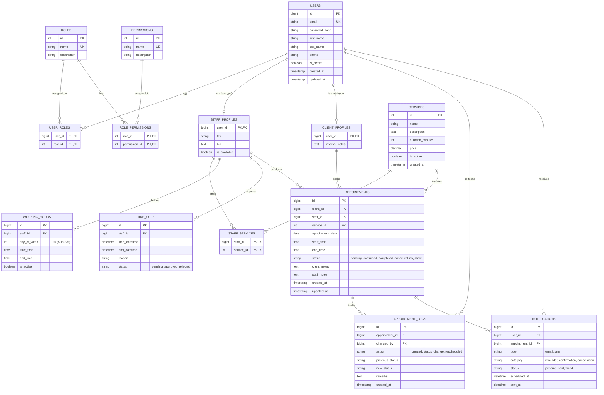

# Client Appointment Management System - EERD

This document outlines the Enhanced Entity-Relationship Diagram (EERD) for the backend database of the Client Appointment Management System. The schema is designed with scalability, auditability, and flexibility in mind.

## Mermaid EERD

## Scalability and Design Notes

1. **Role-Based Access Control (RBAC):** By normalizing users, roles, and permissions into separate tables, the system can seamlessly introduce new roles (e.g., SuperAdmin, Receptionist) without altering the user table schema.
2. **User Subtyping (EERD):** The `USERS` table holds universal traits (auth, contact), while `STAFF_PROFILES` and `CLIENT_PROFILES` extend the user model. This polymorphic-like structure prevents "sparse tables" populated by mostly NULL columns depending on the role.
3. **Availability & Conflict Prevention:** By separating `WORKING_HOURS` (recurring weekly schedule) from `TIME_OFFS` (exceptions, breaks, leaves), the system efficiently queries to detect overlaps and prevent double bookings.
4. **Audit Trails & Client History:** The `APPOINTMENT_LOGS` table tracks every state change of an appointment. This directly satisfies the requirement for a "Client History Module" allowing admins/staff to see full timelines.
5. **Asynchronous Notifications:** A dedicated `NOTIFICATIONS` table is crucial for scalability. Rather than sending emails inline during the HTTP request and potentially causing timeouts, an external queue or cron job can process unsent reminders using this table.
