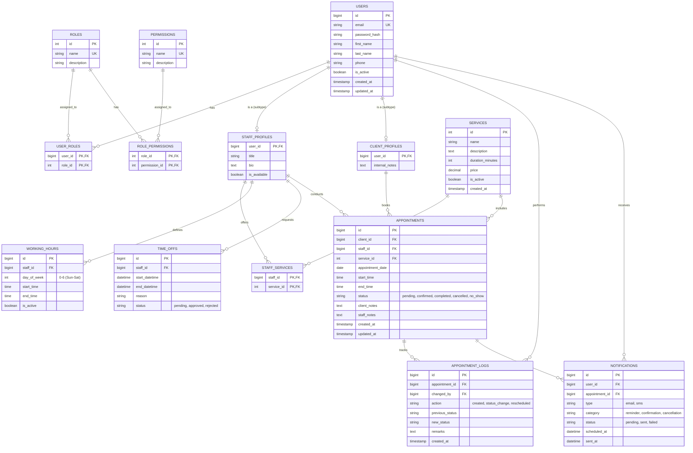

# Database Architecture & Schema

This document outlines the Enhanced Entity-Relationship Diagram (EERD) and specific logic principles governing the OmniSchedule database.

## Scalability and Design Principles

1.  **Role-Based Access Control (RBAC)**: Users, roles, and permissions are normalized. A user can easily be assigned multiple roles, or new system roles (like "Receptionist") can be added without altering the schema.
2.  **Polymorphic User Subtyping**: The `USERS` table holds universal traits (auth, contact details). However, Staff members have bios and titles, while Clients have internal notes. Rather than cluttering `USERS` with nullable columns, we use `STAFF_PROFILES` and `CLIENT_PROFILES` extending the `user_id`.
3.  **Availability Overlaps**: Preventing double-booking is handled by comparing `WORKING_HOURS` (recurring weekly schedules) against `TIME_OFFS` (vacations/breaks) and existing `APPOINTMENTS`.
4.  **Audit Trails**: Every status change to an appointment is tracked in `APPOINTMENT_LOGS`.

---

## Enhanced Entity-Relationship Diagram (EERD)

